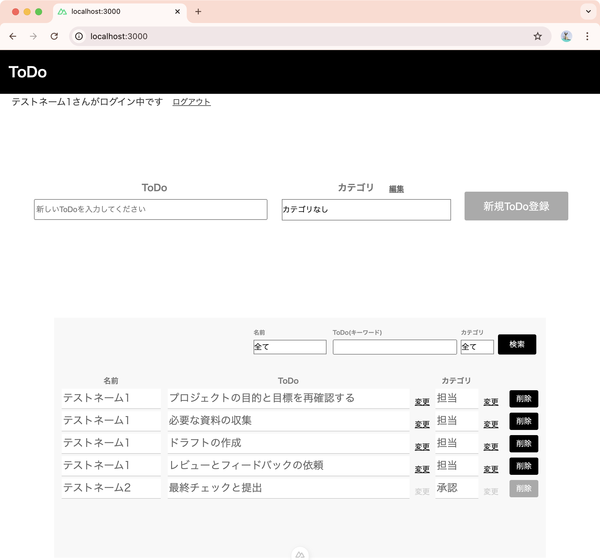

# ToDoアプリ SPA版

ToDo(やること)を可視化するアプリです。個人の予定管理や、作業の抜け漏れ防止、チーム全体の情報管理に役立ちます。

||
|:-:|

## アプリの概要

- Laravel演習講座の「ToDoアプリ」をベースに、バックエンドをLaravel、フロントエンドをNuxt.jsで構築してSPA化しました。
- また、演習のアプリ仕様に対し、以下の機能を追加しています。
  - Firebaseを利用したユーザー登録・ログイン・ログアウト機能
  - ToDoレコードに、作成したユーザーの情報を追加
  - ユーザー名でのToDo検索
  - カテゴリなしでのToDo登録が可能
  - カテゴリを削除した場合に、関連ToDoを削除せず、カテゴリなしに自動で変更
  - カテゴリの更新にモーダルダイアログを利用
  - ログイン中のユーザー以外のToDoを閲覧可能(変更、削除は不可)

## アプリケーションURL

### バックエンド

- 開発環境(Laravel)：<http://localhost/>
- phpMyAdmin：<http://localhost:8080>

### フロントエンド

- 開発環境(Nuxt.js)：<http://localhost:3000/>

## 動作検証に必要なサイト

- Firebase : <https://firebase.google.com/?hl=ja>

## 他のリポジトリ

なし

## 使用技術(実行環境)

### バックエンド (Laravel)

- PHP 8.3.10
- Laravel 8.83.8
- MySQL 8.0.26

### フロントエンド (Nuxt.js)

- nuxt 3.15.4

## Firebase設定

### Firebase consoleにログイン

1. https://firebase.google.com/?hl=ja へアクセスします
2. 右上の「ログイン」ボタンからログインします
3. ログイン後、「コンソールへ移動(Go to console)」をクリックします

### Firebaseプロジェクトの作成

1. 「プロジェクトを追加」からプロジェクトを追加します
2. 任意のプロジェクト名を設定します
3. アナリティクスの設定ページが表示されるので、「続行」を選択します
4. Googleアナリティクスの構成では新しいアカウントを作成を選択し、アナリティクスの地域を「日本」としてプロジェクトを作成します
5. プロジェクトのコンソールに入れたら完了です

### Authenticationの設定

1. Firebaseコンソールの左のメニューから「Authentication」を選択します
2. 「始める」を選択します
3. タブから「ログイン方法」を選択します
4. メール/パスワードを有効にします
5. ステータスが「有効」になれば完了です

### Firebase秘密鍵ダウンロード

1. Firebaseコンソールの左のメニューの設定アイコンから「プロジェクトの設定」をクリックします
2. タブから「サービスアカウント」を選択します
3. 「新しい秘密鍵を生成」をクリックし、秘密鍵（JSONファイル）をダウンロードします

>このJSONファイルを、のちほどLaravelのstorageに保存し、.envファイルにファイル名を記載します

### Firebase設定値の確認

1. Firebaseコンソールの左のメニューの設定アイコンから「プロジェクトの設定」をクリックします
2. タブから「全般」を選択します
3. 「マイアプリ」に記載されている以下の設定値をメモ帳等にコピーしておきます

    ``` text
    apiKey:xxxxxx
    authDomain:xxxxxx
    projectId:xxxxxx
    storageBucket:xxxxxx
    messagingSenderId:xxxxxx
    appId:xxxxxx
    ```

>この設定値を、のちほどNuxt.jsの.envファイルに記載します

## バックエンドアプリ環境構築

### Dockerビルド

1. githubからcloneを作成してください

    ``` bash
    git clone git@github.com:TakaharaYuichiro/todo-spa2.git
    ```

2. DockerDesktopアプリを立ち上げてください

3. cloneしたディレクトリ内のtodo-backディレクトリに移動してください

4. 以下のコマンドによりDockerをビルド・起動してください

    ``` bash
    docker-compose up -d --build
    ```

    > MacのM1・M2チップのPCの場合、
    > `no matching manifest for linux/arm64/v8 in the manifest list entries`
    > のメッセージが表示されビルドができないことがあります。
    > エラーが発生する場合は、docker-compose.ymlファイルの「mysql」内に「platform」の項目を追加で記載してください。
    >
    > ``` bash
    > mysql:
    >     platform: linux/x86_64 (この文追加)
    >     image: mysql:8.0.26
    >     environment:
    > ```

### Laravel環境構築

1. src/storage/appの下に、firebaseディレクトリを作成し、先ほどダウンロードしたFirebaseの秘密鍵(JSONファイル)を、src/storage/app/firebase に配置してください

2. src直下の「.env.example」ファイルをコピーし「.env」に名称を変更してください。または、新しく.envファイルを作成してください

3. .envファイル内の以下の環境変数を、以下のとおり変更もしくは追加してください

    ``` text
    DB_CONNECTION=mysql
    DB_HOST=mysql
    DB_PORT=3306
    DB_DATABASE=laravel_db
    DB_USERNAME=laravel_user
    DB_PASSWORD=laravel_pass

    FIREBASE_CREDENTIALS=/var/www/storage/app/firebase/xxxxx.json
    
    ```

    >※xxxxx.jsonは、先ほどstorageに保存したFirebase秘密鍵鍵のファイル名です

4. 以下のコマンドでPHPコンテナにログインしてください

    ``` bash
    docker-compose exec php bash
    ``` 

5. パッケージをインストールしてください

    ``` bash
    composer install
    ```

6. アプリケーションキーを作成してください

    ``` bash
    php artisan key:generate
    ```

7. マイグレーションを実行してください

    ``` bash
    php artisan migrate
    ```

8. シーディングを実行してください

    ``` bash
    php artisan db:seed
    ```

9. シンボリックリンクを作成してください

    ``` bash
    php artisan storage:link
    ```

## フロントエンドアプリ環境構築

### Nuxt.js環境構築

1. todo-frontディレクトリに移動してください

2. そのディレクトリ直下の「.env.example」ファイルをコピーし「.env」に名称を変更してください。または、新しく.envファイルを作成してください

3. .envファイル内のFirebaseに関する設定を記載してください

    ``` text
    NUXT_PUBLIC_API_URL=http://localhost

    NUXT_PUBLIC_FIREBASE_API_KEY=xxxxxxx
    NUXT_PUBLIC_FIREBASE_AUTH_DOMAIN=xxxxxxx
    NUXT_PUBLIC_FIREBASE_DATABASE_URL=xxxxxxx
    NUXT_PUBLIC_FIREBASE_PROJECT_ID=xxxxxxx
    NUXT_PUBLIC_FIREBASE_STORAGE_BUCKET=xxxxxxx
    NUXT_PUBLIC_FIREBASE_MESSAGING_SENDER_ID=xxxxxxx
    NUXT_PUBLIC_FIREBASE_APP_ID=xxxxxxx
    
    ```

    >xxxxxxxは、先ほどメモ帳等に記録したFirebaseの設定値です

## 動作検証方法

1. todo-frontディレクトリに移動してください
2. 以下のコマンドにより開発用サーバーを起動してください

    ``` bash
    yarn dev
    ```

3. ブラウザでlocalhostにアクセスしてください

    ``` bash
    http://localhost:3000/
    ```

4. ログイン画面の下部に表示されている「会員登録」をクリックしてください
5. 会員登録画面で、お名前、メールアドレス、パスワードを入力し、「会員登録」をクリックしてください
6. アプリのホーム画面が表示されます

## API仕様

### ユーザー登録

Firebaseに登録したユーザーのuidと、その他のユーザー情報を紐づけるためのテーブルにデータを登録します。

* [ユーザー登録](login.md) : `POST /api/register`

### ユーザーデータ取得

DBに登録されているユーザーデータを取得します。

* [ユーザー一覧取得](readme/apis/get_users.md) : `GET /api/users/`
* [ユーザーチェック](readme/apis/get_username.md) : `GET /api/usercheck?idToken={idToken}`

### ToDoデータ操作

ToDoデータの取得や登録などの操作をするためのエンドポイントです。

* [全てのデータ取得](readme/apis/todo/index.md) : `GET /api/todo/`
* [データ登録](readme/apis/todo/store.md) : `POST /api/todo/`
* [データ取得](readme/apis/todo/show.md) : `GET /api/todo/{id}/`
* [データ更新](readme/apis/todo/update.md) : `PUT /api/todo/{id}/`
* [データ削除](readme/apis/todo/destroy.md) : `DELETE /api/todo/{id}/`

### Categoryデータ操作

Categoryデータの取得や登録などの操作をするためのエンドポイントです。

* [全てのデータ取得](readme/apis/category/index.md) : `GET /api/category/`
* [データ登録](readme/apis/category/store.md) : `POST /api/category/`
* [データ取得](readme/apis/category/show.md) : `GET /api/category/{id}/`
* [データ更新](readme/apis/category/update.md) : `PUT /api/category/{id}/`
* [データ削除](readme/apis/category/destroy.md) : `DELETE /api/category/{id}/`

## テーブル設計


## ER図


以上